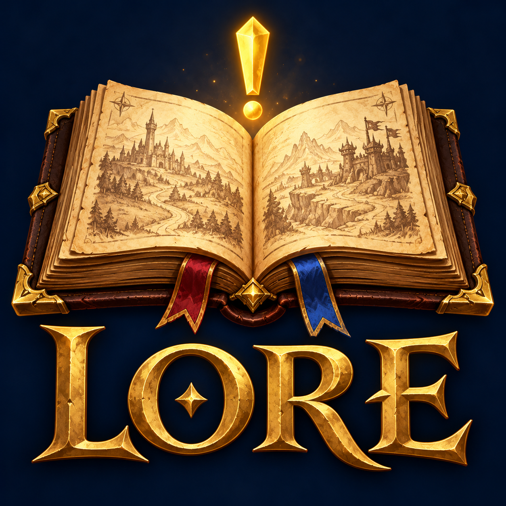

# Lore

<p align="center">
  
</p>

A World of Warcraft addon for Horde and Alliance players that guides you through the story
quests of vanilla WoW. Skip the "kill 10 boars" filler and follow the tales that matter: the
rise of the Burning Blade, Sylvanas's plague, the Defias Brotherhood, the road to Onyxia's
lair.

Lore runs on the **WoW Forever** client and covers vanilla (Classic Era) content only.

> **A vibe-coded experiment.** Lore was primarily built by describing what I wanted to an
> AI coding assistant (Claude), then trying each step in game and giving feedback. I steered
> the design and tested it in game, but I didn't write all of the code by hand. Bug reports
> are very welcome.

## What it does

Lore is a leather-bound book with four bookmarks, bound in your faction's colours: red on
brown leather for the Horde, blue on navy for the Alliance.

- **Current Tale** follows the story you're on, picked up from your quest log. Every
  chapter is listed in order, with Blizzard's quest text, the objective, who gives it and a
  button to show it on the map.
- **Chronicle** lists every tale your race and class can do, grouped into three acts by
  level. Tales that fit your level are highlighted. Click one to read it and see where it
  starts.
- **Journal** keeps the tales you've finished, with the date, your level and where you were.
- **Settings** turns each feature on or off and lists every command.

Around the game world it also:

- Pins where your tale's next chapter starts on the world map and minimap. It never pins
  what the game already marks.
- Puts a small Lore badge on story quests in an NPC's quest list, and a tag beside the quest
  window naming the tale and chapter.
- Adds the tale and chapter to a story quest's tooltip in the quest log.
- Says in chat when a tale begins, moves on or ends.

## How story quests are chosen

Nobody picks the stories by hand. A build script reads the full quest database and decides,
using the same rules for every quest. It runs in five steps, once for each faction, so the
Horde and the Alliance each get their own tales.

**1. Drop what can't be story.** Quests your faction can't do, quests that aren't really in
the game, repeatable quests, and profession, holiday, battleground and reputation-grind
quests.

**2. Score every quest** for how much story it carries:

| Signal                                                          | Points    |
| --------------------------------------------------------------- | --------- |
| Given or received by a lore figure (Thrall, Bolvar, Tyrande...) | +3        |
| Kill a named enemy rather than a crowd                          | +2        |
| Leads into a raid / a dungeon                                   | +2 / +1.5 |
| Lore terms in the text (Scourge, Burning Legion, dragonflight)  | up to +2  |
| Loot from a named enemy                                         | +1        |
| Long quest text, or a pure errand that moves the plot along     | +0.5      |
| "Kill or collect 5 or more" of something ordinary               | -2.5      |
| Gather 3 or more different items                                | -1.5      |

**3. Link quests into chains** using the game's own requirements (which quest unlocks
which). In each group of linked quests, the highest-scoring route becomes a story. Side
quests off that route fall away, and a hub that unlocks many unrelated quests splits into
separate stories. Filler steps the game forces you to do stay in, because you can't skip
them either. When a chain opens with a quest steeped in lore, its follow-up errands from the
same quest giver aren't treated as filler: they serve that story.

**4. Keep the best.** A story's score is its chapters added up, plus a small bonus for
length. Up to 16 stories are kept per 10 levels, so long level-60 raid chains can't crowd
out the early game. Importance (minor, notable, major) is ranked within each level range.

**5. Fill in what's required.** Every quest a kept story needs before you can accept one
of its chapters is added to it, even filler, so you're never sent to a quest you can't pick
up. If another tale already tells that quest, the chapter says which tale to finish first.
A tale is only offered to races and classes that can do every one of its chapters.

The result is 110 Horde tales (50 in the open world, 29 leading into dungeons, 6 into raids
and 25 class quests) and 116 Alliance tales (55, 29, 5 and 27). Each takes its name from one
of its quests, and a few names were adjusted where the rule picked an errand instead of the
story.

The rules can't read. A dull quest with dramatic wording can score well, and a quiet but
important one can be missed. If a tale is missing, shouldn't be there, or has a poor name,
please open an issue.

## Install

1. Download `Lore-x.y.z.zip` from the
   [latest release](https://github.com/cvandal/lore/releases/latest). Not "Source code":
   that's the whole project, not the addon.
2. Unzip it into your WoW Forever AddOns folder, so you end up with:

   ```
   World of Warcraft/_classic_beta_/Interface/AddOns/Lore/Lore.toc
   ```

3. Start the game, or restart it if it's running, and make sure **Lore** is ticked in the
   AddOns list on the character screen.
4. Log in with a Horde or Alliance character and type `/lore`, or click the note icon on
   the minimap.

## Commands

| Command          | Does                                                    |
| ---------------- | ------------------------------------------------------- |
| `/lore`          | Open or close the book                                  |
| `/lore settings` | Open the Settings page                                  |
| `/lore pins`     | Turn map pins on or off                                 |
| `/lore minimap`  | Show or hide the minimap button                         |
| `/lore badges`   | Turn story badges on or off                             |
| `/lore messages` | Turn story messages in chat on or off                   |
| `/lore reset`    | Move the book back to the middle of the screen          |
| `/lore debug`    | Report what Lore sees in an NPC window, for bug reports |

## Thanks

Lore wouldn't exist without two addons and the people behind them:

- **[Questie](https://github.com/Questie/Questie)** and
  **[QuestieDB](https://github.com/Questie/QuestieDB)**: every quest, NPC, location and chain
  link in Lore comes from their years of careful, corrected data. Lore also uses Questie's
  copy of the HereBeDragons map library.
- **[pfQuest](https://github.com/shagu/pfQuest)**: the quest text you read in the
  book comes from pfQuest's database.

Thank you for building them and sharing them.

## Contributing

See [CONTRIBUTING.md](CONTRIBUTING.md) for how the addon is put together, how to rebuild
the story data, and how to run the tests.

## License

Lore is free software under the [GNU General Public License v3](LICENSE): anyone can use,
change and share it, as long as what they share stays under the same licence. This matches
Questie, whose data Lore is built from.

- pfQuest is MIT licensed, © Eric Mauser (Shagu).
- HereBeDragons (Nevcairiel) is BSD licensed. LibStub is public domain, and CallbackHandler
  comes from Ace3.
- Quest text, names and game art are © Blizzard Entertainment. Lore uses only textures
  already in the game and ships no images of its own.

Lore is a fan project and isn't affiliated with Blizzard Entertainment.
